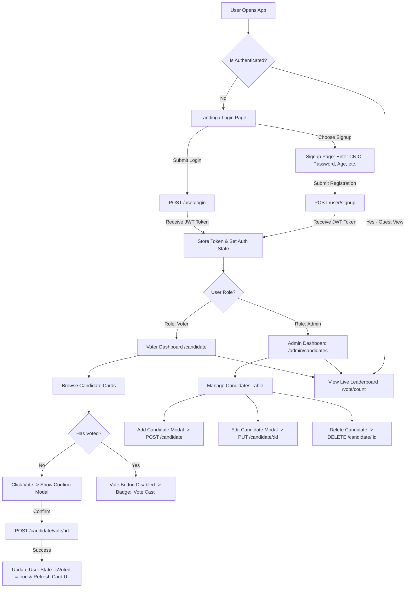

# Project Analysis & Architecture Document

## Executive Summary

This document provides a comprehensive analysis of the **Voting Application** project (`voting-app`). The analysis compares the original project specification (`planning.txt`) with the actual Node.js/Express implementation, documents the project structure, details data models and API routes, highlights discovered bugs/discrepancies, and outlines a complete React + Tailwind CSS frontend architecture & workflow.

---

## 📁 Project Structure

```
voting-app/
├── models/
│   ├── candidate.js       # Mongoose schema & model for Candidates and Vote records
│   └── user.js            # Mongoose schema, pre-save password hashing, & comparePassword method for Users
├── routes/
│   ├── candidateRoutes.js # Route handlers for candidate CRUD, voting mechanism, and live vote counts
│   └── userRoutes.js      # Route handlers for user signup, login, profile retrieval, and password updates
├── .env                   # Configuration file storing PORT, Mongo DB connection string, and JWT Secret
├── db.js                  # Database connection utility setting up Mongoose connection with MongoDB
├── jwt.js                 # Authentication helper defining JWT verification middleware and token generator
├── package.json           # Project manifest, scripts, and dependency definitions
├── package-lock.json      # Locked dependency versions tree
├── planning.txt           # Functional requirements and API design specifications
└── server.js              # Application entry point initializing Express server, body parser, and routes
```

### Detailed File Responsibilities

| File / Folder                   | Purpose & Functionality                                                                                                                                                                      |
| :------------------------------ | :------------------------------------------------------------------------------------------------------------------------------------------------------------------------------------------- |
| **`server.js`**                 | Entry point of the Node application. Configures Express app, loads `.env`, attaches `body-parser`, mounts `/user` and `/candidate` router endpoints, and listens on configured port.         |
| **`db.js`**                     | Handles MongoDB database connection using Mongoose. Connects to `LOCAL_DB_URL` specified in `.env` and sets fallback DNS servers (`8.8.8.8`, `1.1.1.1`).                                     |
| **`jwt.js`**                    | Export `jwtMiddleWare` (verifies Authorization header Bearer token and attaches decoded user to `req.user`) and `generateToken` (signs payload with `JWT_SECRET`).                           |
| **`models/user.js`**            | Defines `User` schema (`cnic`, `password`, `age`, `email`, `mobile`, `address`, `role`, `isVoted`). Implements pre-save hook for password hashing (`bcryptjs`) and `comparePassword` method. |
| **`models/candidate.js`**       | Defines `Candidate` schema (`name`, `party`, `age`, `voteCount`, `votes` sub-document array tracking voter ID and timestamp).                                                                |
| **`routes/userRoutes.js`**      | Handles `/signup`, `/login`, `/profile`, and `/profile/password` endpoints.                                                                                                                  |
| **`routes/candidateRoutes.js`** | Handles candidate management (`POST`, `GET`, `PUT`, `DELETE` on `/`) and voting actions (`POST /vote/:id`, `GET /vote/count`). Includes admin authorization helper (`checkAdminRole`).       |
| **`planning.txt`**              | Project requirement roadmap defining user roles (Voter vs Admin), rules, and expected API endpoints.                                                                                         |

---

## 🎯 Requirements Analysis (`planning.txt` vs Implementation)

| Feature / Requirement         | `planning.txt` Specification                | Codebase Implementation Status               | Notes / Status                                            |
| :---------------------------- | :------------------------------------------ | :------------------------------------------- | :-------------------------------------------------------- |
| **User Sign Up / Sign In**    | `/signup` & `/login` using ID & password    | ✅ Implemented in `userRoutes.js`            | Functional                                                |
| **Unique Govt ID Proof**      | Required (`cnic number`)                    | ✅ Implemented as `cnic` in `user.js`        | Aligned with updated `planning.txt`                       |
| **Candidate List View**       | `/candidates` GET                           | ✅ Implemented (`GET /candidate/`)           | Returns candidate `name` & `party`                        |
| **Voting Mechanism**          | Single vote per user (`/vote/:candidateId`) | ✅ Implemented (`POST /candidate/vote/:id`)  | Updates vote count & sets `isVoted = true`                |
| **Live Vote Count**           | `/vote/counts` GET sorted by count          | ✅ Implemented (`GET /candidate/vote/count`) | Sorted descending by `voteCount`                          |
| **Admin Role & Restrictions** | Admin manages candidates, **cannot vote**   | ✅ Implemented in `candidateRoutes.js`       | Admin restricted from voting via `role === 'admin'` check |
| **User Profile Management**   | GET profile & PUT change password           | ⚠️ Routes exist in `userRoutes.js`           | Contains runtime logic bugs (detailed below)              |

---

## 🛠️ Data Models & Database Schemas

### User Schema (`models/user.js`)

- `cnic`: Number (Required, Unique) - _Serves as Unique Govt ID_
- `password`: String (Required, Hashed via bcrypt)
- `age`: Number (Required)
- `email`: String (Unique)
- `mobile`: String
- `address`: String (Required)
- `role`: String (`enum: ['voter', 'admin']`, Default: `'voter'`)
- `isVoted`: Boolean (Default: `false`)

### Candidate Schema (`models/candidate.js`)

- `name`: String (Required)
- `party`: String (Required, Unique)
- `age`: Number (Required)
- `voteCount`: Number (Default: `0`)
- `votes`: Array of Sub-documents:
  - `user`: ObjectId (Ref: `User`, Required)
  - `votedAt`: Date (Default: `Date.now`)

---

## 🌐 API Route Mapping

### User Routes (Base Path: `/user`)

| Method | Endpoint            | Auth Required | Admin Only | Description                                |
| :----- | :------------------ | :-----------: | :--------: | :----------------------------------------- |
| `POST` | `/signup`           |      ❌       |     ❌     | Create new user account & return JWT       |
| `POST` | `/login`            |      ❌       |     ❌     | Authenticate user using CNIC & password    |
| `GET`  | `/profile`          |      ✅       |     ❌     | Fetch authenticated user's profile details |
| `PUT`  | `/profile/password` |      ✅       |     ❌     | Change authenticated user's password       |

### Candidate Routes (Base Path: `/candidate`)

| Method   | Endpoint      | Auth Required | Admin Only | Description                                           |
| :------- | :------------ | :-----------: | :--------: | :---------------------------------------------------- |
| `GET`    | `/`           |      ❌       |     ❌     | Get list of candidates (`name`, `party`)              |
| `POST`   | `/`           |      ✅       |     ✅     | Add new candidate                                     |
| `PUT`    | `/:id`        |      ✅       |     ✅     | Update candidate details                              |
| `DELETE` | `/:id`        |      ✅       |     ✅     | Remove candidate                                      |
| `POST`   | `/vote/:id`   |      ✅       | ❌ (Voter) | Cast vote for candidate (Admin excluded)              |
| `GET`    | `/vote/count` |      ❌       |     ❌     | Get candidate list sorted by `voteCount` (descending) |

---

## 🐛 Identified Backend Bugs & Defect Analysis

During the analysis of the existing codebase, the following runtime bugs and code quality issues were identified:

1. **`GET /user/profile` Request Payload Bug**
   - **File**: [userRoutes.js](file:///d:/c++/web/voting-app/routes/userRoutes.js#L46-L59)
   - **Issue**: Line 48 (`const userData = req.body; const userId = userData.id`) attempts to extract `id` from `req.body` instead of the JWT payload attached at `req.user.id`.
   - **Impact**: Fetching user profile fails with `User not found` or error.

2. **`PUT /user/profile/password` Reference Error**
   - **File**: [userRoutes.js](file:///d:/c++/web/voting-app/routes/userRoutes.js#L61-L77)
   - **Issue**: Line 63 references `user.id` (`const userId = user.id`) before `user` variable is declared (Line 65).
   - **Impact**: Causes `ReferenceError: Cannot access 'user' before initialization` crash when attempting to change password.

3. **`PUT /candidate/:id` Redundant Operation**
   - **File**: [candidateRoutes.js](file:///d:/c++/web/voting-app/routes/candidateRoutes.js#L46-L65)
   - **Issue**: Line 55 uses `findByIdAndUpdate`. Line 60 then executes `await candidate.save()`.
   - **Impact**: Redundant DB operation; will throw error if `candidate` is `null`.

4. **Dependency Mismatch (`bcrypt` vs `bcryptjs`)**
   - **File**: [user.js](file:///d:/c++/web/voting-app/models/user.js#L2) vs [package.json](file:///d:/c++/web/voting-app/package.json#L14)
   - **Issue**: `package.json` lists `bcrypt`, but `models/user.js` imports `bcryptjs`.
   - **Impact**: Potential `MODULE_NOT_FOUND` error if `bcryptjs` is missing in `node_modules`.

---

## 🎨 Recommended React + Tailwind CSS Frontend Workflow & Architecture

To build a modern, high-performance, and visual-first frontend for this Voting Application backend, the following workflow and architecture is recommended.

---

### 1. Recommended Tech Stack

- **Core Framework**: React 18+ with Vite (for fast builds & HMR)
- **Styling**: Tailwind CSS v3/v4 + Tailwind Merge (`tailwind-merge`, `clsx`)
- **Icons**: `lucide-react` (clean modern outline icons)
- **Routing**: `react-router-dom` v6
- **State Management & Auth**: React Context API (`AuthContext`) or `zustand`
- **HTTP Client**: `axios` with global Interceptors (automatically attaches Bearer token to headers)
- **Notifications**: `react-hot-toast` or `sonner` (sleek, non-intrusive notification toasts)
- **Animations**: `framer-motion` (for smooth card transitions, voting modal popups, and live count bar updates)

---

### 2. Proposed Frontend Directory Structure (`voting-app-client/`)

```
voting-app-client/
├── public/
│   └── favicon.ico
├── src/
│   ├── api/
│   │   ├── axiosInstance.js    # Axios setup with auth header interceptor & 401 handler
│   │   ├── authApi.js          # login, signup, getProfile, updatePassword
│   │   └── candidateApi.js     # getCandidates, voteCandidate, getVoteCounts, CRUD for admin
│   ├── assets/
│   │   └── party-logos/        # Optional party icons/logos
│   ├── components/
│   │   ├── common/
│   │   │   ├── Navbar.jsx          # Header with user info, status badge, theme/logout
│   │   │   ├── ProtectedRoute.jsx  # Auth wrapper for protected pages
│   │   │   ├── AdminRoute.jsx      # Role check wrapper for Admin pages
│   │   │   ├── LoadingSpinner.jsx  # Animated pulse/spinner loader
│   │   │   └── Modal.jsx           # Reusable accessible backdrop modal
│   │   ├── candidate/
│   │   │   ├── CandidateCard.jsx   # Candidate display card with party badge & Vote button
│   │   │   ├── VoteConfirmModal.jsx# Confirm vote dialog before finalizing
│   │   │   └── CandidateModal.jsx  # Admin Add/Edit Candidate form modal
│   │   └── leaderboard/
│   │       ├── LiveLeaderboard.jsx # Animated rank listing with vote count bars
│   │       └── VoteProgressBar.jsx # Percentage bar visualization per candidate
│   ├── context/
│   │   └── AuthContext.jsx     # User state, token persistence (localStorage), login/logout methods
│   ├── pages/
│   │   ├── Login.jsx           # CNIC + Password login form page
│   │   ├── Signup.jsx          # Full user registration form page
│   │   ├── Dashboard.jsx        # Voter candidate list & voting action page
│   │   ├── LeaderboardPage.jsx # Public live election leaderboard
│   │   ├── ProfilePage.jsx     # User details & change password section
│   │   └── AdminDashboard.jsx  # Candidate management table for Admin
│   ├── App.jsx                 # Route definitions & global providers
│   ├── main.jsx                # Entry point rendering React root
│   └── index.css               # Tailwind CSS imports & custom utility classes
├── tailwind.config.js          # Tailwind theme custom colors, fonts, animations
├── vite.config.js              # Vite configuration with API proxy setting
└── package.json
```

---

### 3. Complete User Experience & Routing Workflow



---

### 4. Detailed Implementation Roadmap (10 Step Workflow)

#### Step 1: React + Vite + Tailwind Setup

1. Create frontend project: `npx create-vite@latest client --template react`
2. Install Tailwind CSS & dependencies:
   ```bash
   npm install -D tailwindcss postcss autoprefixer
   npx tailwindcss init -p
   npm install axios lucide-react react-router-dom react-hot-toast framer-motion clsx tailwind-merge
   ```
3. Configure `tailwind.config.js` with dark theme palette (slate/indigo/emerald), custom glassmorphic styling, and animation utilities.

#### Step 2: Axios API Layer Setup (`src/api/axiosInstance.js`)

- Configure base URL (`http://localhost:3000`).
- Implement request interceptor to automatically attach `Authorization: Bearer <token>` from `localStorage`.
- Implement response interceptor to handle `401 Unauthorized` by clearing stale tokens and redirecting to `/login`.

#### Step 3: Auth Context (`src/context/AuthContext.jsx`)

- Maintain `user` object (`_id`, `cnic`, `role`, `isVoted`), `token`, and `loading` states.
- Persist token in `localStorage`.
- Provide `login(cnic, password)`, `signup(formData)`, `logout()`, and `refetchProfile()` functions across the component tree.

#### Step 4: Protected & Admin Route Guards

- `ProtectedRoute`: Checks token existence. Redirects to `/login` if unauthenticated.
- `AdminRoute`: Checks if `user.role === 'admin'`. Displays an authorization warning if a non-admin voter attempts to access admin routes.

#### Step 5: Auth Pages (`Login.jsx` & `Signup.jsx`)

- **Login**: Input fields for CNIC (Numeric format validation) and Password. Clear error messages for invalid credentials.
- **Signup**: Step/Section form capturing CNIC, Password, Age (>18 validation), Email, Mobile, and Address. Toggle switch for role assignment (Voter vs Admin).

#### Step 6: Voter Dashboard (`Dashboard.jsx` & `CandidateCard.jsx`)

- Grid view of active candidates with party badges, candidate age, and bio/description.
- **Interactive Vote Button**:
  - Disabled with message _"Admins cannot vote"_ if logged in as Admin.
  - Disabled with badge _"You have already voted"_ if `user.isVoted === true`.
  - Enabled if `user.isVoted === false` & `role === 'voter'`. Clicking triggers a sleek confirmation modal before sending `POST /candidate/vote/:id`.

#### Step 7: Live Results & Leaderboard (`LiveLeaderboard.jsx`)

- Public page showing real-time rankings sorted by `voteCount` descending (using `GET /candidate/vote/count`).
- Visual representation:
  - Ranked position badges (🥇 #1, 🥈 #2, 🥉 #3).
  - Dynamic progress bars (`Framer Motion` animated width based on `(candidateVote / totalVotes) * 100`).
  - Auto-polling interval (e.g., every 5-10 seconds) or manual refresh button.

#### Step 8: Admin Candidate Management (`AdminDashboard.jsx`)

- Comprehensive management panel for Admin users.
- Candidate Data Table showing Candidate Name, Party, Age, Total Votes, and Actions.
- **Add Candidate Modal**: Form to post new candidates (`POST /candidate`).
- **Edit Candidate Modal**: Form to update candidate info (`PUT /candidate/:id`).
- **Delete Action**: Confirmation prompt before removal (`DELETE /candidate/:id`).

#### Step 9: User Profile & Password Update (`ProfilePage.jsx`)

- View profile details (CNIC, Email, Mobile, Address, Voting Status).
- **Change Password Form**: Inputs for `currentPassword` and `newPassword` hitting `PUT /user/profile/password`.

#### Step 10: Aesthetic Polish & Final Testing

- **Glassmorphism UI Design**: Semi-transparent dark cards (`bg-slate-900/80 backdrop-blur-md border border-slate-800`).
- **Responsive Layout**: Seamless mobile navigation menu & grid layouts (`grid-cols-1 md:grid-cols-2 lg:grid-cols-3`).
- **Toast Notifications**: Crisp success/error feedback on every API action.

---

## 🚀 Recommendations & Next Steps

1. **Backend Bug Fixes First**: Apply fixes for the identified bugs in `userRoutes.js` and `candidateRoutes.js` before connecting the frontend.
2. **CORS Middleware**: Enable `cors` middleware in `server.js` (`app.use(cors())`) to allow requests from `http://localhost:5173` (Vite dev server).
3. **Frontend Scaffold**: Initialize the `voting-app-client` directory following the 10-step roadmap outlined above.
